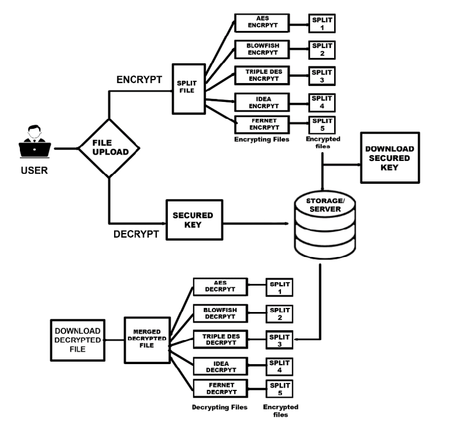
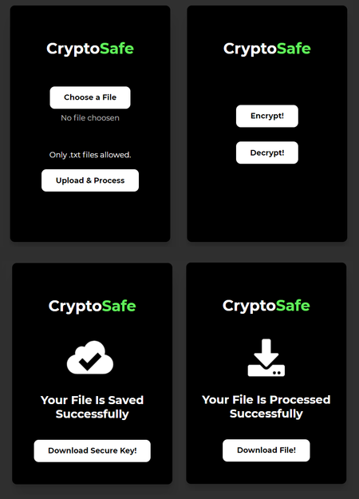

# CryptoSafe: A secure file storage flask web app

    
     
 

This project presents the hybrid encryption scheme which combines the quick encryption schemes of encryption algorithms like AES, Blowfish, Triple DES, IDEA, Fernet. The proposed approach includes file splitting and merging mechanism along with Multi Threads to simultaneously encrypt files.

    
     
 

    
     
 

